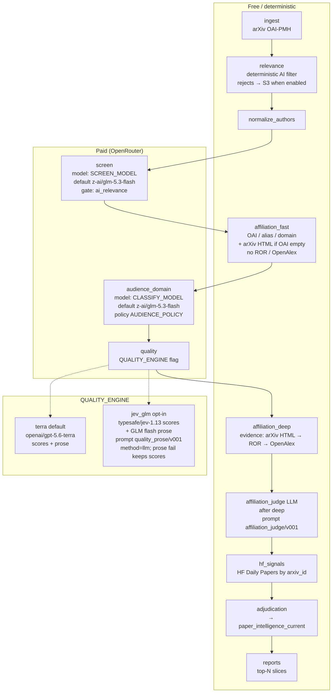

# Pipeline flow (Mermaid)

Canonical stage order, models/engines, and affiliation evidence. Update this file when any of those change (`docs/WRAP_UP_MY_DAY.md` §5).

## Evidence hierarchy (affiliation)

| Phase | Sources | Notes |
|---|---|---|
| **fast** (pre-quality) | OAI / existing `affiliation_text` + local alias/domain; **arXiv HTML** when OAI empty | No ROR / OpenAlex |
| **deep** (post-quality) | **arXiv HTML → ROR → OpenAlex** | Enrichment after quality (quality stays author/org-blind) |
| **judge** (after deep) | LLM `affiliation_judge` | Resolves / verifies; evidence type `llm_affiliation_judge` |

## Engine flag

| Flag | Default | Effect |
|---|---|---|
| `QUALITY_ENGINE` | `terra` | `terra` = Terra scores+prose; `jev_glm` = Jev v001 scores + GLM prose |

Paid stages require `--from` / `--until` and `--allow-paid`.
